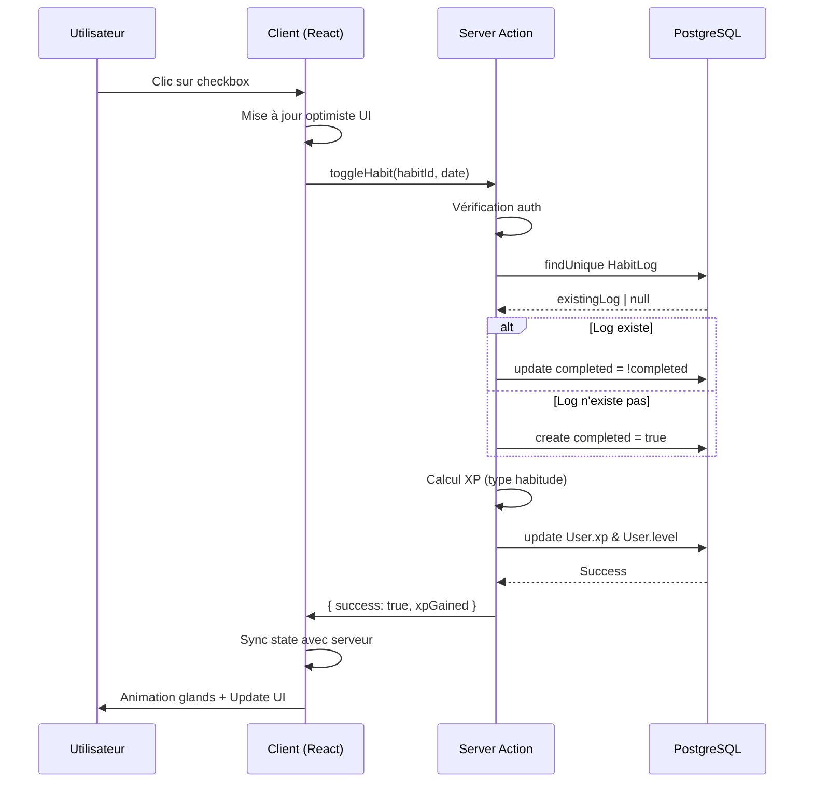
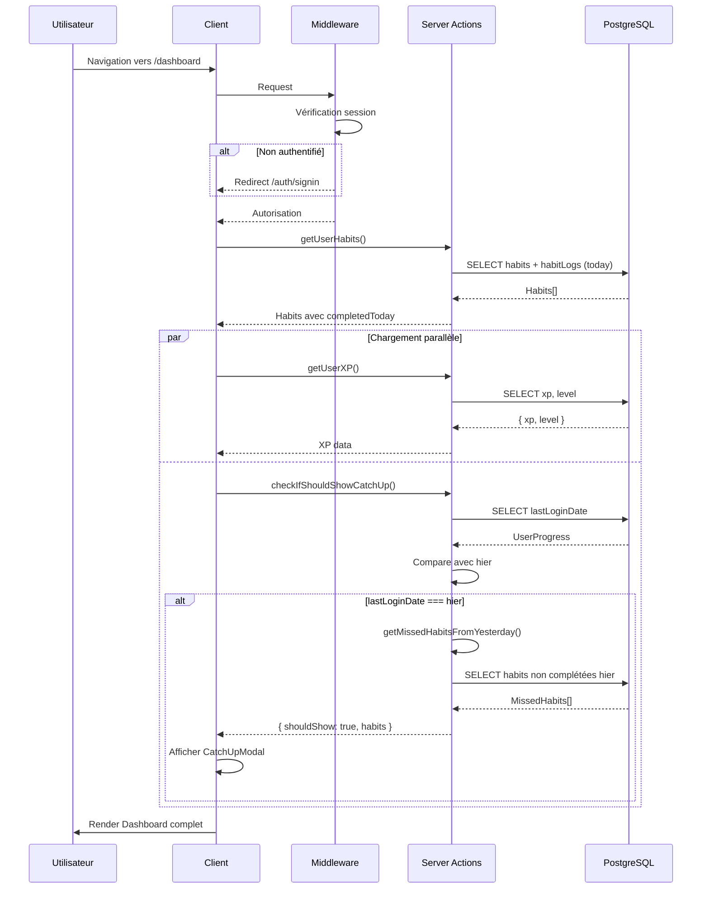
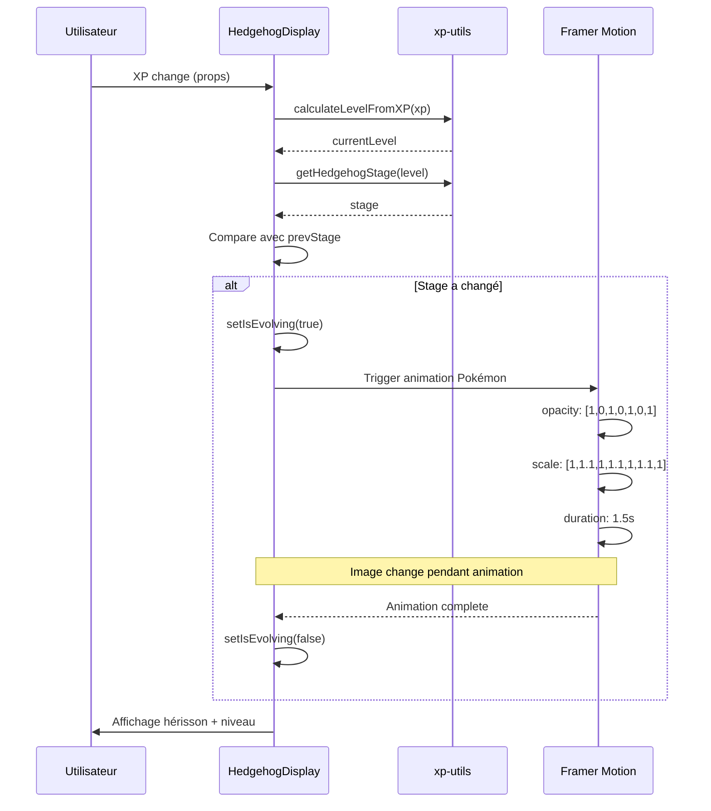

# 🦔 HabitHisson - Architecture Technique Détaillée

> **Documentation technique complète pour présentation orale**  
> Version : MVP + Gamification + Statistiques (Décembre 2025)

---

## 📋 Table des Matières

1. [Vue d'Ensemble](#vue-densemble)
2. [Architecture du Monorepo](#architecture-du-monorepo)
3. [Stack Technique](#stack-technique)
4. [Base de Données & Modélisation](#base-de-données--modélisation)
5. [Architecture Frontend](#architecture-frontend)
6. [Architecture Backend](#architecture-backend)
7. [Système de Gamification](#système-de-gamification)
8. [Gestion du Temps & Debug](#gestion-du-temps--debug)
9. [Sécurité & Performance](#sécurité--performance)
10. [Patterns & Bonnes Pratiques](#patterns--bonnes-pratiques)
11. [Flux de Données Critiques](#flux-de-données-critiques)

---

## 🎯 Vue d'Ensemble

### Concept de l'Application

**HabitHisson** est une application de suivi d'habitudes gamifiée où l'utilisateur fait grandir un hérisson virtuel en accomplissant ses objectifs quotidiens et hebdomadaires. Le projet combine :

- **Tracking d'habitudes** : Système de complétion avec historique
- **Gamification** : Système XP/niveaux, évolution du hérisson (5 stades)
- **Rattrapage intelligent** : Modal pour récupérer les oublis du jour précédent
- **Statistiques avancées** : Graphiques de productivité, streaks, classements
- **Design enfantin** : Interface colorée, animations fluides (Framer Motion)

### Problématique Technique

**Défi principal** : Comment créer une application **temps-réel** qui gère la **progression temporelle** des habitudes tout en maintenant une **expérience utilisateur fluide** et **motivante** ?

**Solutions apportées** :
1. **Architecture monorepo** pour la réutilisabilité du code
2. **Server Actions Next.js 15** pour une communication client-serveur optimisée
3. **Système de dates UTC** pour éviter les décalages timezone
4. **Mise à jour optimiste** pour une UI réactive instantanée
5. **Animations Framer Motion** pour le feedback visuel engageant

---

## 🏗️ Architecture du Monorepo

### Structure TurboRepo

```
HabitHisson/
├── apps/
│   └── web/                    # Application Next.js principale
│       ├── app/                # App Router (routing file-based)
│       ├── components/         # Composants React UI
│       ├── lib/                # Logique métier & actions serveur
│       └── public/             # Assets statiques (images hérisson)
│
├── packages/
│   ├── db/                     # Package Prisma partagé
│   │   └── prisma/
│   │       └── schema.prisma   # Schéma de base unique
│   ├── ui/                     # Composants UI réutilisables
│   │   └── src/styles/
│   │       └── globals.css     # Thème Tailwind global
│   ├── common/                 # Utilitaires partagés
│   ├── eslint-config/          # Config ESLint partagée
│   └── typescript-config/      # Config TS partagée
│
└── turbo.json                  # Configuration des tasks Turbo
```

### Avantages de cette Architecture

#### 1. **Séparation des Responsabilités**
- **`apps/web`** : Interface utilisateur et routing
- **`packages/db`** : Schéma et client Prisma (source unique de vérité)
- **`packages/ui`** : Design system réutilisable

#### 2. **Hot Module Replacement Optimisé**
```json
// turbo.json
{
  "tasks": {
    "dev": {
      "cache": false,      // Pas de cache en dev pour l'HMR
      "persistent": true   // Process long-running
    }
  }
}
```

#### 3. **Build Incrémentaux**
TurboRepo détecte les changements et ne rebuild que les packages modifiés :
```bash
✓ Packages in scope: @repo/db, web
✓ Packages with changes: web
✓ Running build in 1 package (cache hit: 5 packages)
```

### Gestion des Dépendances (pnpm workspaces)

```json
// apps/web/package.json
{
  "dependencies": {
    "@repo/db": "workspace:*",     // Lien vers package local
    "@repo/ui": "workspace:*",
    "next": "15.2.6",
    "react": "^19.0.0"
  }
}
```

**Pourquoi pnpm ?**
- **Efficacité disque** : Liens symboliques au lieu de copies
- **Strict mode** : Empêche l'accès aux dépendances non déclarées
- **Workspaces natifs** : Support monorepo sans configuration

---

## 🛠️ Stack Technique

### Frontend

| Technologie | Version | Rôle | Justification |
|------------|---------|------|---------------|
| **Next.js** | 15.2.6 | Framework React | App Router, Server Actions, optimisations perf |
| **React** | 19.0.0 | Bibliothèque UI | Hooks modernes (useOptimistic à venir) |
| **TypeScript** | 5.8.2 | Typage statique | Sécurité du code, auto-complétion IDE |
| **Tailwind CSS** | v4 | Styling | Utility-first, performance, DX |
| **Framer Motion** | 12.23.25 | Animations | Animations déclaratives, gestures |
| **Zod** | 4.1.13 | Validation schemas | Type-safe validation côté client/serveur |

### Backend & Base de Données

| Technologie | Version | Rôle | Justification |
|------------|---------|------|---------------|
| **Prisma** | 6.5.0 | ORM | Type-safe queries, migrations automatiques |
| **PostgreSQL** | Latest (Neon) | Base de données | Relationnel, transactions ACID, scalabilité |
| **NextAuth.js** | 5.0.0-beta.30 | Authentification | Session JWT, providers extensibles |
| **bcryptjs** | 3.0.3 | Hash passwords | Sécurité des mots de passe |

### Tooling & Infrastructure

- **TurboRepo** : Orchestration du monorepo
- **pnpm** : Gestionnaire de packages
- **ESLint** : Linting du code
- **Vercel** : Plateforme de déploiement (serverless)

---

## 🗄️ Base de Données & Modélisation

### Schéma Prisma Complet

```prisma
// packages/db/prisma/schema.prisma

datasource db {
  provider = "postgresql"
  url      = env("DATABASE_URL")
}

generator client {
  provider = "prisma-client-js"
}

// ═══════════════════════════════════════════════════════
// 👤 UTILISATEURS
// ═══════════════════════════════════════════════════════
model User {
  id              Int       @id @default(autoincrement())
  email           String    @unique
  name            String?
  password        String
  level           Int       @default(1)        // Niveau de gamification
  xp              Int       @default(0)        // Points d'expérience (glands)
  hedgehogState   String    @default("baby")   // État du hérisson
  profilePublic   Boolean   @default(false)    // Pour classements futurs
  createdAt       DateTime  @default(now())
  updatedAt       DateTime  @updatedAt

  habits          Habit[]
  habitLogs       HabitLog[]
  userProgress    UserProgress?

  @@index([xp, level]) // Index pour classements
}

// ═══════════════════════════════════════════════════════
// 📋 HABITUDES
// ═══════════════════════════════════════════════════════
model Habit {
  id          Int        @id @default(autoincrement())
  userId      Int
  name        String
  emoji       String
  type        HabitType  @default(GOOD)
  frequency   Frequency  @default(DAILY)
  isActive    Boolean    @default(true)    // Soft delete
  createdAt   DateTime   @default(now())
  updatedAt   DateTime   @updatedAt

  user        User       @relation(fields: [userId], references: [id], onDelete: Cascade)
  habitLogs   HabitLog[]

  @@index([userId, isActive])
}

enum HabitType {
  GOOD   // Habitude positive (cocher = +XP)
  BAD    // Habitude négative (cocher = -XP)
}

enum Frequency {
  DAILY    // Quotidienne (10 glands)
  WEEKLY   // Hebdomadaire (50 glands)
}

// ═══════════════════════════════════════════════════════
// 📊 LOGS DE COMPLÉTION
// ═══════════════════════════════════════════════════════
model HabitLog {
  id        Int      @id @default(autoincrement())
  habitId   Int
  userId    Int
  date      DateTime @db.Date        // Stockage en UTC (date seule)
  completed Boolean  @default(true)  // True = fait, False = manqué
  createdAt DateTime @default(now()) // Timestamp de création

  habit     Habit    @relation(fields: [habitId], references: [id], onDelete: Cascade)
  user      User     @relation(fields: [userId], references: [id], onDelete: Cascade)

  @@unique([habitId, date])         // Une seule entrée par habitude/jour
  @@index([userId, date])
  @@index([habitId, date, completed]) // Optimisation calcul streaks
}

// ═══════════════════════════════════════════════════════
// 🎯 PROGRESSION UTILISATEUR
// ═══════════════════════════════════════════════════════
model UserProgress {
  id            Int       @id @default(autoincrement())
  userId        Int       @unique
  totalXp       Int       @default(0)
  currentLevel  Int       @default(1)
  bestStreak    Int       @default(0)       // Meilleur streak historique
  lastLoginDate DateTime? @db.Date          // Pour détecter les jours manqués
  lastActivity  DateTime?
  createdAt     DateTime  @default(now())
  updatedAt     DateTime  @updatedAt

  user          User      @relation(fields: [userId], references: [id], onDelete: Cascade)

  @@index([userId, lastLoginDate])
}
```

### Design Decisions Clés

#### 1. **Soft Delete sur les Habitudes**
```prisma
isActive Boolean @default(true)
```
**Pourquoi ?** Permet de garder l'historique complet même après suppression, essentiel pour les statistiques.

#### 2. **Type `@db.Date` pour les HabitLog**
```prisma
date DateTime @db.Date
```
**Pourquoi ?** Stocke uniquement la date (sans heure) en UTC, évite les bugs de timezone.

#### 3. **Contrainte Unique Composite**
```prisma
@@unique([habitId, date])
```
**Pourquoi ?** Empêche les doublons de complétion pour un même jour.

#### 4. **Index Stratégiques**
```prisma
@@index([habitId, date, completed])
```
**Pourquoi ?** Optimise les requêtes de calcul des streaks (queries fréquentes).

#### 5. **Relations en Cascade**
```prisma
@relation(..., onDelete: Cascade)
```
**Pourquoi ?** Suppression automatique des données liées quand un utilisateur est supprimé.

### Évolution du Schéma (Migrations)

```bash
packages/db/prisma/migrations/
├── 20251126105318_init_habit_tracker/
│   └── migration.sql                    # Migration initiale
└── 20251202082307_complete_habit_hisson_schema/
    └── migration.sql                    # Ajout gamification + UserProgress
```

**Commandes de migration** :
```bash
# Créer une nouvelle migration
cd packages/db
npx prisma migrate dev --name add_feature_x

# Appliquer en production
npx prisma migrate deploy

# Régénérer le client TypeScript
npx prisma generate
```

---

## 🎨 Architecture Frontend

### App Router (Next.js 15)

#### Structure de Routing

```
app/
├── layout.tsx                    # Layout racine (providers, fonts)
├── page.tsx                      # Page d'accueil (redirect si authentifié)
│
├── auth/
│   ├── signin/page.tsx          # Connexion
│   └── signup/page.tsx          # Inscription
│
├── dashboard/
│   ├── page.tsx                 # Vue principale (habitudes du jour)
│   ├── calendar/page.tsx        # Calendrier mensuel
│   ├── profile/page.tsx         # Profil utilisateur
│   └── stats/page.tsx           # Statistiques & classement
│
└── api/
    └── auth/
        └── [...nextauth]/
            └── route.ts         # Route API NextAuth
```

#### Layout Système

```tsx
// app/layout.tsx
export default function RootLayout({ children }: { children: React.ReactNode }) {
  return (
    <html lang="fr">
      <body className={geistSans.variable}>
        <Providers>            {/* Context providers globaux */}
          {children}
          <DebugTimeMenu />    {/* Menu debug temporel (dev only) */}
        </Providers>
      </body>
    </html>
  )
}
```

**Providers imbriqués** :
```tsx
// components/providers.tsx
export function Providers({ children }: { children: React.ReactNode }) {
  return (
    <SessionProvider>         {/* NextAuth session */}
      <DebugTimeProvider>     {/* Context de date simulée */}
        {children}
      </DebugTimeProvider>
    </SessionProvider>
  )
}
```

### Composants Clés

#### 1. **HedgehogDisplay** - Affichage du Hérisson

```tsx
// components/hedgehog-display.tsx
interface HedgehogDisplayProps {
  xp: number
  showXPBar?: boolean
  size?: 'small' | 'medium' | 'large'
  onXPGain?: (amount: number) => void
}

export function HedgehogDisplay({ xp, showXPBar, size, onXPGain }: HedgehogDisplayProps) {
  const { currentLevel, xpInCurrentLevel, xpRequiredForNextLevel, progressPercent } = 
    getLevelProgress(xp)
  
  const stage = getHedgehogStage(currentLevel)
  const imagePath = getHedgehogImagePath(stage)
  const [isEvolving, setIsEvolving] = useState(false)

  // Détection de changement de stade
  useEffect(() => {
    const prevStage = getHedgehogStage(calculateLevelFromXP(xp - 10))
    if (stage !== prevStage) {
      setIsEvolving(true)
      setTimeout(() => setIsEvolving(false), 1500)
    }
  }, [stage, xp])

  return (
    <div className="relative flex flex-col items-center">
      {/* Animation d'évolution style Pokémon */}
      <motion.div
        animate={isEvolving ? {
          opacity: [1, 0, 1, 0, 1, 0, 1],
          scale: [1, 1.1, 1, 1.1, 1, 1.1, 1],
        } : {}}
        transition={{ duration: 1.5 }}
      >
        <Image src={imagePath} alt="Hérisson" width={256} height={256} />
      </motion.div>

      {/* Badge de niveau */}
      <div className="mt-2 bg-gradient-to-r from-orange-400 to-orange-600 text-white px-4 py-2 rounded-full">
        Niveau {currentLevel}
      </div>

      {/* Barre de progression XP */}
      {showXPBar && (
        <div className="w-full max-w-xs mt-3">
          <div className="flex justify-between text-sm mb-1">
            <span className="flex items-center gap-1">
              <Image src="/icons/gland.webp" width={14} height={14} />
              {xpInCurrentLevel}
            </span>
            <span className="flex items-center gap-1">
              <Image src="/icons/gland.webp" width={14} height={14} />
              {xpRequiredForNextLevel}
            </span>
          </div>
          <motion.div
            className="h-3 bg-green-500 rounded-full"
            initial={{ width: 0 }}
            animate={{ width: `${progressPercent}%` }}
            transition={{ duration: 0.5 }}
          />
        </div>
      )}
    </div>
  )
}
```

**Points techniques** :
- **Calcul dynamique** : `getLevelProgress()` calcule XP/niveau en temps réel
- **Animation conditionnelle** : Détection du changement de stade via `useEffect`
- **Framer Motion** : `motion.div` pour animations déclaratives
- **Optimisation images** : `next/image` avec lazy loading

#### 2. **CatchUpModal** - Rattrapage des Oublis

```tsx
// components/catch-up-modal.tsx
interface CatchUpModalProps {
  missedHabits: MissedHabit[]
  onClose: () => void
}

export default function CatchUpModal({ missedHabits, onClose }: CatchUpModalProps) {
  const [catching, setCatching] = useState<number | null>(null)

  const handleCatchUp = async (habitId: number) => {
    setCatching(habitId)
    const result = await catchUpHabit(habitId) // Server Action
    
    if (result.success) {
      // Mise à jour optimiste de l'UI
      setMissedHabits(prev => prev.filter(h => h.id !== habitId))
    }
    setCatching(null)
  }

  return (
    <div className="fixed inset-0 bg-black/60 backdrop-blur-sm flex items-center justify-center z-50">
      <motion.div
        initial={{ scale: 0.9, opacity: 0 }}
        animate={{ scale: 1, opacity: 1 }}
        className="bg-white rounded-3xl p-8 max-w-md"
      >
        <h2 className="text-2xl font-bold text-orange-600 mb-4">
          🕐 Rattrapage du {yesterday.toLocaleDateString('fr-FR')}
        </h2>
        
        <p className="text-gray-600 mb-6">
          Tu as oublié ces habitudes hier. Veux-tu les rattraper ?
        </p>

        <div className="space-y-3">
          {missedHabits.map(habit => (
            <div key={habit.id} className="flex items-center justify-between p-4 bg-gray-50 rounded-xl">
              <span className="text-lg">{habit.emoji} {habit.name}</span>
              <button
                onClick={() => handleCatchUp(habit.id)}
                disabled={catching === habit.id}
                className="btn-primary"
              >
                {catching === habit.id ? '⏳' : '✓ Rattraper'}
              </button>
            </div>
          ))}
        </div>

        <button onClick={onClose} className="btn-secondary w-full mt-4">
          Ignorer
        </button>
      </motion.div>
    </div>
  )
}
```

**Logique métier** :
1. **Détection** : Au chargement du dashboard, `checkIfShouldShowCatchUp()` compare `lastLoginDate` avec aujourd'hui
2. **Récupération** : `getMissedHabitsFromYesterday()` trouve les habitudes non complétées d'hier
3. **Action** : `catchUpHabit()` crée un `HabitLog` rétroactivement pour hier avec `completed: true`

#### 3. **AcornAnimation** - Animation des Glands

```tsx
// components/acorn-animation.tsx
interface AcornAnimationProps {
  startPosition: { x: number; y: number }
  endPosition: { x: number; y: number }
  count: number
  onComplete: () => void
}

export function AcornAnimation({ startPosition, endPosition, count, onComplete }: AcornAnimationProps) {
  return (
    <>
      {Array.from({ length: count }).map((_, i) => (
        <motion.div
          key={i}
          className="fixed pointer-events-none z-50"
          style={{
            left: startPosition.x,
            top: startPosition.y,
          }}
          initial={{ opacity: 1, scale: 1 }}
          animate={{
            x: endPosition.x - startPosition.x,
            y: endPosition.y - startPosition.y,
            scale: [1, 1.2, 0.8],
            rotate: [0, 180, 360],
          }}
          transition={{
            duration: 0.8,
            delay: i * 0.1,
            ease: [0.43, 0.13, 0.23, 0.96], // Courbe de Bézier custom
          }}
          onAnimationComplete={i === count - 1 ? onComplete : undefined}
        >
          <Image src="/icons/gland.webp" width={32} height={32} alt="gland" />
        </motion.div>
      ))}
    </>
  )
}
```

**Trajectoire personnalisée** :
- **Courbe de Bézier** : `ease: [0.43, 0.13, 0.23, 0.96]` pour une animation naturelle
- **Stagger animation** : Délai de 0.1s entre chaque gland
- **Fixed positioning** : Permet l'animation par-dessus toute l'UI

### Gestion d'État

#### Patterns Utilisés

1. **useState** pour l'état local UI
```tsx
const [habits, setHabits] = useState<Habit[]>([])
const [loading, setLoading] = useState(true)
```

2. **useEffect** pour le chargement initial
```tsx
useEffect(() => {
  async function loadData() {
    const data = await getUserHabits()
    setHabits(data)
  }
  loadData()
}, [])
```

3. **Mise à jour optimiste**
```tsx
const handleToggle = async (habitId: number) => {
  // 1. Update UI immédiatement
  setHabits(prev => prev.map(h => 
    h.id === habitId ? { ...h, completed: !h.completed } : h
  ))
  
  // 2. Appel serveur
  const result = await toggleHabit(habitId)
  
  // 3. Rollback si erreur
  if (!result.success) {
    setHabits(prev => prev.map(h => 
      h.id === habitId ? { ...h, completed: !h.completed } : h
    ))
  }
}
```

4. **Context API** pour le debug temporel
```tsx
// lib/debug-time-context.tsx
const DebugTimeContext = createContext<{
  debugDate: Date | null
  setDebugDate: (date: Date) => void
}>({ debugDate: null, setDebugDate: () => {} })

export function useCurrentDate() {
  const { debugDate } = useContext(DebugTimeContext)
  return debugDate || new Date()
}
```

---

## ⚙️ Architecture Backend

### Server Actions (Next.js 15)

**Concept** : Les Server Actions permettent d'appeler du code serveur directement depuis les composants clients, sans créer d'API Routes.

#### Exemple : Toggle d'Habitude

```typescript
// lib/habit-actions.ts
'use server'

import { auth } from '@/lib/auth'
import { prisma } from '@repo/db'
import { calculateXPGain, calculateLevelFromXP } from '@/lib/xp-utils'

export async function toggleHabit(habitId: number, date: Date) {
  // 1. Authentification
  const session = await auth()
  if (!session?.user?.id) {
    redirect('/auth/signin')
  }

  const userId = parseInt(session.user.id)
  const dateOnly = new Date(Date.UTC(date.getFullYear(), date.getMonth(), date.getDate()))

  try {
    // 2. Récupération de l'habitude
    const habit = await prisma.habit.findUnique({
      where: { id: habitId },
      select: { frequency: true, type: true }
    })

    if (!habit) {
      return { success: false, error: 'Habitude non trouvée.' }
    }

    // 3. Toggle du log
    const existingLog = await prisma.habitLog.findUnique({
      where: { habitId_date: { habitId, date: dateOnly } }
    })

    let willBeCompleted = false
    const wasCompletedBefore = existingLog?.completed ?? false

    if (existingLog) {
      await prisma.habitLog.update({
        where: { habitId_date: { habitId, date: dateOnly } },
        data: { completed: !existingLog.completed }
      })
      willBeCompleted = !existingLog.completed
    } else {
      await prisma.habitLog.create({
        data: { habitId, userId, date: dateOnly, completed: true }
      })
      willBeCompleted = true
    }

    // 4. Calcul XP
    let xpGained = 0
    const baseXP = calculateXPGain(habit.frequency)
    const isGoodHabit = habit.type === 'GOOD'

    if (willBeCompleted && !wasCompletedBefore) {
      // Habitude cochée
      xpGained = isGoodHabit ? baseXP : -baseXP
    } else if (!willBeCompleted && wasCompletedBefore) {
      // Habitude décochée
      xpGained = isGoodHabit ? -baseXP : baseXP
    }

    // 5. Mise à jour XP utilisateur
    if (xpGained !== 0) {
      const currentUser = await prisma.user.findUnique({
        where: { id: userId },
        select: { xp: true }
      })

      const newXP = Math.max(0, (currentUser?.xp || 0) + xpGained)
      const newLevel = calculateLevelFromXP(newXP)

      await prisma.user.update({
        where: { id: userId },
        data: { xp: newXP, level: newLevel }
      })
    }

    // 6. Revalidation du cache Next.js
    revalidatePath('/dashboard')

    return { success: true, xpGained }
  } catch (error) {
    console.error('Erreur toggleHabit:', error)
    return { success: false, error: 'Erreur serveur.' }
  }
}
```

**Avantages des Server Actions** :
- ✅ **Type-safe** : Types partagés entre client/serveur
- ✅ **Pas de boilerplate** : Pas besoin de créer des API routes
- ✅ **Streaming** : Support du streaming de données (React Suspense)
- ✅ **Sécurité** : Code serveur jamais exposé au client

### Authentification (NextAuth.js v5)

#### Configuration

```typescript
// lib/auth.ts
import NextAuth from 'next-auth'
import Credentials from 'next-auth/providers/credentials'
import { prisma } from '@repo/db'
import bcrypt from 'bcryptjs'

export const { handlers, signIn, signOut, auth } = NextAuth({
  providers: [
    Credentials({
      credentials: {
        email: { label: "Email", type: "email" },
        password: { label: "Password", type: "password" }
      },
      async authorize(credentials) {
        const user = await prisma.user.findUnique({
          where: { email: credentials.email as string }
        })

        if (!user) return null

        const passwordMatch = await bcrypt.compare(
          credentials.password as string,
          user.password
        )

        if (!passwordMatch) return null

        return {
          id: user.id.toString(),
          email: user.email,
          name: user.name
        }
      }
    })
  ],
  callbacks: {
    async jwt({ token, user }) {
      if (user) {
        token.id = user.id
      }
      return token
    },
    async session({ session, token }) {
      if (session.user) {
        session.user.id = token.id as string
      }
      return session
    }
  },
  pages: {
    signIn: '/auth/signin'
  }
})
```

#### Middleware de Protection

```typescript
// middleware.ts
import { auth } from '@/lib/auth'

export default auth((req) => {
  const isLoggedIn = !!req.auth
  const isProtectedRoute = req.nextUrl.pathname.startsWith('/dashboard')

  if (isProtectedRoute && !isLoggedIn) {
    return Response.redirect(new URL('/auth/signin', req.url))
  }
})

export const config = {
  matcher: ['/((?!api|_next/static|_next/image|favicon.ico).*)']
}
```

### Gestion des Erreurs

#### Pattern Try-Catch Universel

```typescript
export async function someAction() {
  const session = await auth()
  
  if (!session?.user?.id) {
    redirect('/auth/signin')
  }

  try {
    // Logique métier
    const result = await prisma.something.create({...})
    revalidatePath('/dashboard')
    return { success: true, data: result }
  } catch (error) {
    console.error('Error in someAction:', error)
    return { success: false, error: 'Une erreur est survenue.' }
  }
}
```

#### Validation Zod

```typescript
import { z } from 'zod'

const CreateHabitSchema = z.object({
  name: z.string().min(1).max(50),
  emoji: z.string().min(1),
  type: z.enum(['GOOD', 'BAD']),
  frequency: z.enum(['DAILY', 'WEEKLY'])
})

export async function createHabit(formData: FormData) {
  const validated = CreateHabitSchema.safeParse({
    name: formData.get('name'),
    emoji: formData.get('emoji'),
    type: formData.get('type'),
    frequency: formData.get('frequency')
  })

  if (!validated.success) {
    return {
      errors: validated.error.flatten().fieldErrors,
      message: 'Données invalides.'
    }
  }

  // ... création
}
```

---

## 🎮 Système de Gamification

### Formules XP/Niveaux

#### 1. **Gain d'XP**

```typescript
// lib/xp-utils.ts
export function calculateXPGain(frequency: 'DAILY' | 'WEEKLY'): number {
  return frequency === 'DAILY' ? 10 : 50
}
```

**Logique des gains/pertes** :
```typescript
// BONNE habitude
- Cocher = +10 glands (quotidien) / +50 glands (hebdomadaire)
- Décocher = -10/-50 glands

// MAUVAISE habitude
- Cocher = -10/-50 glands (pénalité pour avoir cédé)
- Décocher = +10/+50 glands (récompense pour avoir résisté)
```

#### 2. **Calcul du Niveau**

```typescript
export function calculateLevelFromXP(xp: number): number {
  // Formule : Level = √(XP / 100)
  const safeXP = Math.max(0, xp) // Protection contre XP négatif
  return Math.floor(Math.sqrt(safeXP / 100)) + 1
}

export function getXPForLevel(level: number): number {
  // Formule inverse : XP = (Level - 1)² × 100
  return Math.pow(level - 1, 2) * 100
}
```

**Exemples** :
```
Niveau 1 → 0-99 XP (départ)
Niveau 2 → 100-399 XP (100 glands nécessaires)
Niveau 3 → 400-899 XP (300 glands supplémentaires)
Niveau 5 → 1600-2499 XP
Niveau 10 → 8100-9999 XP
Niveau 20 → 36100-40000 XP
```

#### 3. **Progression dans le Niveau**

```typescript
export function getLevelProgress(xp: number) {
  const safeXP = Math.max(0, xp)
  const currentLevel = calculateLevelFromXP(safeXP)
  const xpForCurrentLevel = getXPForLevel(currentLevel)
  const xpForNextLevel = getXPForLevel(currentLevel + 1)
  
  const xpInCurrentLevel = safeXP - xpForCurrentLevel
  const xpRequiredForNextLevel = xpForNextLevel - xpForCurrentLevel
  
  const progressPercent = Math.min(
    100,
    Math.max(0, (xpInCurrentLevel / xpRequiredForNextLevel) * 100)
  )

  return {
    currentLevel,
    xpInCurrentLevel,
    xpRequiredForNextLevel,
    progressPercent
  }
}
```

### Évolution du Hérisson

#### Stades de Croissance

```typescript
export function getHedgehogStage(level: number): number {
  if (level >= 20) return 5  // Elder
  if (level >= 15) return 4  // Adult
  if (level >= 10) return 3  // Teen
  if (level >= 5) return 2   // Child
  return 1                    // Baby
}

export function getHedgehogImagePath(stage: number): string {
  return `/hedgehogs/herisson-${stage}.png`
}

export function getStageLabel(stage: number): string {
  const labels = ['', 'Bébé', 'Enfant', 'Ado', 'Adulte', 'Ancien']
  return labels[stage] || 'Inconnu'
}
```

#### Animation d'Évolution (Style Pokémon)

```tsx
// Dans HedgehogDisplay.tsx
useEffect(() => {
  const prevStage = getHedgehogStage(calculateLevelFromXP(xp - 10))
  const currentStage = getHedgehogStage(currentLevel)
  
  if (currentStage !== prevStage) {
    setIsEvolving(true)
    
    // Animation de 1.5s
    setTimeout(() => {
      setIsEvolving(false)
    }, 1500)
  }
}, [xp, currentLevel])

// JSX
<motion.div
  animate={isEvolving ? {
    opacity: [1, 0, 1, 0, 1, 0, 1],  // Clignotement
    scale: [1, 1.1, 1, 1.1, 1, 1.1, 1]
  } : {}}
  transition={{ duration: 1.5, ease: 'easeInOut' }}
>
  <Image src={getHedgehogImagePath(stage)} />
</motion.div>
```

### Système de Streaks

#### Calcul des Streaks

```typescript
// lib/calendar-actions.ts
export async function getHabitStreaks(): Promise<HabitStreak[]> {
  const habits = await prisma.habit.findMany({
    where: { userId, isActive: true },
    include: {
      habitLogs: {
        where: { completed: true },
        orderBy: { date: 'desc' }
      }
    }
  })

  return habits.map(habit => {
    // Calcul du streak actuel (jours consécutifs)
    let currentStreak = 0
    const sortedLogs = habit.habitLogs.sort((a, b) => 
      new Date(b.date).getTime() - new Date(a.date).getTime()
    )

    for (let i = 0; i < sortedLogs.length; i++) {
      const expectedDate = new Date()
      expectedDate.setDate(expectedDate.getDate() - i)
      
      const logDate = new Date(sortedLogs[i].date)
      
      if (
        logDate.getDate() === expectedDate.getDate() &&
        logDate.getMonth() === expectedDate.getMonth() &&
        logDate.getFullYear() === expectedDate.getFullYear()
      ) {
        currentStreak++
      } else {
        break
      }
    }

    // Calcul du meilleur streak historique
    let bestStreak = 0
    let tempStreak = 0
    let prevDate: Date | null = null

    for (const log of sortedLogs) {
      if (!prevDate) {
        tempStreak = 1
      } else {
        const dayDiff = Math.floor(
          (prevDate.getTime() - new Date(log.date).getTime()) / (1000 * 60 * 60 * 24)
        )
        
        if (dayDiff === 1) {
          tempStreak++
        } else {
          bestStreak = Math.max(bestStreak, tempStreak)
          tempStreak = 1
        }
      }
      prevDate = new Date(log.date)
    }
    bestStreak = Math.max(bestStreak, tempStreak)

    return {
      habitId: habit.id,
      name: habit.name,
      emoji: habit.emoji,
      currentStreak,
      bestStreak,
      totalCompletions: habit.habitLogs.length
    }
  })
}
```

#### Couleurs de Progression

```typescript
function getStreakColor(completions: number): string {
  if (completions >= 100) return 'border-purple-500 bg-purple-50'
  if (completions >= 50) return 'border-blue-500 bg-blue-50'
  if (completions >= 20) return 'border-green-500 bg-green-50'
  if (completions >= 10) return 'border-yellow-500 bg-yellow-50'
  return 'border-gray-300 bg-gray-50'
}
```

---

## ⏰ Gestion du Temps & Debug

### Problématique des Timezones

**Problème initial** : Décalage entre l'heure locale (CET/CEST) et l'heure UTC stockée en base.

**Exemple de bug** :
```
Utilisateur à Paris (UTC+1) coche une habitude à 23h30
→ Stockée en base avec date UTC = 22h30 (jour précédent)
→ Affichée comme "hier" au lieu de "aujourd'hui"
```

**Solution** : Utiliser UTC partout

```typescript
// ❌ AVANT (bugué)
const dateOnly = new Date(today.getFullYear(), today.getMonth(), today.getDate())

// ✅ APRÈS (corrigé)
const dateOnly = new Date(Date.UTC(today.getFullYear(), today.getMonth(), today.getDate()))
```

### Mode Debug Temporel

#### Contexte React pour la Date Simulée

```typescript
// lib/debug-time-context.tsx
interface DebugTimeContextType {
  debugDate: Date | null
  setDebugDate: (date: Date | null) => void
  advanceDay: () => void
  goToDate: (date: Date) => void
}

export const DebugTimeContext = createContext<DebugTimeContextType>({
  debugDate: null,
  setDebugDate: () => {},
  advanceDay: () => {},
  goToDate: () => {}
})

export function DebugTimeProvider({ children }: { children: ReactNode }) {
  const [debugDate, setDebugDateState] = useState<Date | null>(() => {
    if (typeof window === 'undefined') return null
    if (!process.env.NEXT_PUBLIC_DEBUG_MODE) return null
    
    const stored = localStorage.getItem('debug_date')
    return stored ? new Date(stored) : null
  })

  const setDebugDate = (date: Date | null) => {
    setDebugDateState(date)
    if (date) {
      localStorage.setItem('debug_date', date.toISOString())
    } else {
      localStorage.removeItem('debug_date')
    }
  }

  const advanceDay = () => {
    const current = debugDate || new Date()
    const next = new Date(current)
    next.setDate(next.getDate() + 1)
    setDebugDate(next)
  }

  return (
    <DebugTimeContext.Provider value={{ debugDate, setDebugDate, advanceDay, goToDate }}>
      {children}
    </DebugTimeContext.Provider>
  )
}

// Hook personnalisé
export function useCurrentDate(): Date {
  const { debugDate } = useContext(DebugTimeContext)
  return debugDate || new Date()
}
```

#### Menu Debug Flottant

```tsx
// components/debug-time-menu.tsx
export default function DebugTimeMenu() {
  if (!process.env.NEXT_PUBLIC_DEBUG_MODE) return null

  const { debugDate, advanceDay, setDebugDate } = useDebugTime()
  const currentDate = useCurrentDate()

  return (
    <motion.div
      className="fixed bottom-20 right-4 bg-white rounded-2xl shadow-2xl p-4 z-50 border-2 border-orange-300"
      initial={{ opacity: 0, scale: 0.8 }}
      animate={{ opacity: 1, scale: 1 }}
    >
      <div className="text-sm font-bold text-orange-600 mb-2">
        ⏱️ Mode Debug Temporel
      </div>
      
      <div className="text-xs text-gray-600 mb-3">
        Date actuelle : {currentDate.toLocaleDateString('fr-FR')}
      </div>

      <div className="space-y-2">
        <button onClick={advanceDay} className="btn-primary w-full text-xs">
          ⏭️ Avancer d'1 jour
        </button>
        
        <button 
          onClick={() => setDebugDate(null)} 
          className="btn-secondary w-full text-xs"
        >
          🔄 Réinitialiser
        </button>
      </div>
    </motion.div>
  )
}
```

#### Activation

```bash
# .env.local
NEXT_PUBLIC_DEBUG_MODE=true
NODE_ENV=development
```

**Utilisation dans les composants** :
```tsx
// Au lieu de new Date()
const today = useCurrentDate()

// Dans les Server Actions
export async function someAction(simulatedDate?: Date) {
  const date = simulatedDate || new Date()
  // ...
}
```

---

## 🔒 Sécurité & Performance

### Sécurité

#### 1. **Hash des Mots de Passe**

```typescript
import bcrypt from 'bcryptjs'

// Inscription
const hashedPassword = await bcrypt.hash(password, 10)
await prisma.user.create({
  data: {
    email,
    password: hashedPassword
  }
})

// Connexion
const passwordMatch = await bcrypt.compare(password, user.password)
```

#### 2. **Protection CSRF**

NextAuth.js gère automatiquement :
- Tokens CSRF dans les formulaires
- Same-site cookies
- Verification des origins

#### 3. **SQL Injection**

Prisma utilise des **prepared statements** :
```typescript
// ✅ Safe (Prisma)
await prisma.user.findUnique({
  where: { email: userInput }
})

// ❌ Dangereux (Raw SQL)
await prisma.$executeRaw`SELECT * FROM User WHERE email = ${userInput}`
```

#### 4. **XSS**

React escape automatiquement les variables :
```tsx
// ✅ Safe
<div>{userInput}</div>

// ❌ Dangereux
<div dangerouslySetInnerHTML={{ __html: userInput }} />
```

### Performance

#### 1. **Optimisation Prisma**

```typescript
// ✅ Select uniquement les champs nécessaires
const user = await prisma.user.findUnique({
  where: { id: userId },
  select: { xp: true, level: true }  // Pas de select * implicite
})

// ✅ Index sur les colonnes fréquemment filtrées
@@index([userId, date])
@@index([habitId, date, completed])
```

#### 2. **Batching des Requêtes**

```typescript
// ✅ Charger en parallèle
const [habits, xp, streaks] = await Promise.all([
  getUserHabits(),
  getUserXP(),
  getHabitStreaks()
])

// ❌ Séquentiel (lent)
const habits = await getUserHabits()
const xp = await getUserXP()
const streaks = await getHabitStreaks()
```

#### 3. **Revalidation Sélective**

```typescript
// Invalider uniquement la page modifiée
revalidatePath('/dashboard')

// Pas de revalidation globale
revalidatePath('/', 'layout')  // ❌ Trop large
```

#### 4. **Next.js Image Optimization**

```tsx
<Image
  src="/hedgehogs/herisson-1.png"
  width={256}
  height={256}
  priority={false}     // Lazy loading par défaut
  quality={85}         // Compression automatique
  alt="Hérisson"
/>
```

#### 5. **Code Splitting**

```tsx
// Lazy loading des composants lourds
const StatsCharts = dynamic(() => import('@/components/stats-charts'), {
  loading: () => <Spinner />,
  ssr: false  // Client-side only si graphiques
})
```

---

## 🎯 Patterns & Bonnes Pratiques

### 1. **Server Actions Pattern**

```typescript
// Structure standard d'une action
export async function actionName(params: Type) {
  // 1. Authentification
  const session = await auth()
  if (!session?.user?.id) redirect('/auth/signin')

  // 2. Validation
  const validated = Schema.safeParse(params)
  if (!validated.success) return { success: false, errors: ... }

  // 3. Transaction base de données
  try {
    const result = await prisma.model.create({...})
    
    // 4. Revalidation cache
    revalidatePath('/path')
    
    // 5. Retour structuré
    return { success: true, data: result }
  } catch (error) {
    console.error('Error:', error)
    return { success: false, error: 'Message utilisateur' }
  }
}
```

### 2. **Error Boundaries**

```tsx
// app/error.tsx
'use client'

export default function Error({ error, reset }: {
  error: Error & { digest?: string }
  reset: () => void
}) {
  useEffect(() => {
    console.error('Error boundary:', error)
  }, [error])

  return (
    <div className="min-h-screen flex items-center justify-center">
      <div className="text-center">
        <h2 className="text-2xl font-bold text-red-600 mb-4">
          Une erreur est survenue
        </h2>
        <button onClick={reset} className="btn-primary">
          Réessayer
        </button>
      </div>
    </div>
  )
}
```

### 3. **Type Safety Prisma → Frontend**

```typescript
// Définition des types depuis Prisma
import type { Habit, HabitLog } from '@prisma/client'

// Types enrichis pour le frontend
export type HabitWithLogs = Habit & {
  habitLogs: HabitLog[]
  completedToday?: boolean
}

// Utilisation dans les composants
interface HabitCardProps {
  habit: HabitWithLogs
  onToggle: (id: number) => Promise<void>
}
```

### 4. **Atomic Design**

```
components/
├── atoms/              # Éléments de base
│   ├── Button.tsx
│   └── Input.tsx
├── molecules/          # Combinaisons simples
│   ├── HabitCard.tsx
│   └── StreakBadge.tsx
├── organisms/          # Sections complexes
│   ├── HabitList.tsx
│   └── StatsChart.tsx
└── templates/          # Layouts de page
    ├── DashboardLayout.tsx
    └── AuthLayout.tsx
```

### 5. **Custom Hooks**

```typescript
// Hook pour les habitudes
export function useHabits() {
  const [habits, setHabits] = useState<Habit[]>([])
  const [loading, setLoading] = useState(true)

  useEffect(() => {
    async function load() {
      const data = await getUserHabits()
      setHabits(data)
      setLoading(false)
    }
    load()
  }, [])

  const toggle = async (id: number) => {
    const result = await toggleHabit(id, new Date())
    if (result.success) {
      setHabits(prev => prev.map(h => 
        h.id === id ? { ...h, completedToday: !h.completedToday } : h
      ))
    }
  }

  return { habits, loading, toggle }
}
```

---

## 🔄 Flux de Données Critiques

### Flux 1 : Toggle d'Habitude



### Flux 2 : Chargement Dashboard



### Flux 3 : Évolution du Hérisson



---

## 📚 Conclusion & Perspectives

### Points Forts de l'Architecture

1. **Scalabilité** : Monorepo permet d'ajouter facilement de nouvelles apps
2. **Type Safety** : TypeScript + Prisma = 0 erreur de type en production
3. **Performance** : Server Actions + optimistic updates = UX fluide
4. **Maintenabilité** : Séparation claire backend/frontend/database
5. **DX (Developer Experience)** : Hot reload, types auto-générés, Turbo cache

### Améliorations Futures

#### Phase 3 : Compétition & Social

- **Classement temps réel** : WebSockets pour updates live
- **Rooms de compétition** : Groupes d'amis qui se challengent
- **Achievements** : Système de badges déblocables
- **Exports** : CSV/PDF des statistiques

#### Optimisations Techniques

- **Redis cache** : Pour les leaderboards et stats
- **CDN** : Images du hérisson via Vercel Image Optimization
- **WebSockets** : Notifications temps réel
- **PWA** : Application installable, offline-first

#### Infrastructure

- **CI/CD** : GitHub Actions pour tests + déploiement auto
- **Monitoring** : Sentry pour error tracking
- **Analytics** : Plausible Analytics (privacy-friendly)
- **E2E Tests** : Playwright pour tester les flux critiques

---

## 🎤 Guide pour la Présentation Orale

### Structure Recommandée (15-20 min)

1. **Introduction (2 min)**
   - Problématique : Difficulté à maintenir des habitudes
   - Solution : Gamification + tracking visuel

2. **Architecture Globale (3 min)**
   - Schéma monorepo
   - Stack technique justifiée
   - Séparation des responsabilités

3. **Démonstration Live (5 min)**
   - Créer une habitude
   - Toggle → voir animation glands
   - Mode debug → avancer dans le temps
   - Voir évolution du hérisson

4. **Deep Dive Technique (8 min)**
   - **Base de données** : Modélisation, contraintes, index
   - **Server Actions** : Code du toggleHabit expliqué
   - **Gamification** : Formule XP, calcul streaks
   - **Performance** : Mise à jour optimiste, parallel queries

5. **Challenges & Solutions (2 min)**
   - Problème timezone → Solution UTC
   - XP négatif → Protection Math.max(0)
   - Animation fluide → Framer Motion + Bézier curves

### Points à Mettre en Avant

- ✅ **Choix technologiques justifiés** (pas juste "parce que c'est populaire")
- ✅ **Problèmes réels résolus** (timezone, optimistic updates)
- ✅ **Code maintenable** (types, patterns, structure claire)
- ✅ **UX pensée** (animations, feedback immédiat, rattrapage)

### Questions Probables

**Q: Pourquoi un monorepo ?**  
R: Réutilisabilité du code, builds incrémentaux, single source of truth pour le schéma DB.

**Q: Pourquoi Server Actions au lieu d'API Routes ?**  
R: Type-safety bout-en-bout, moins de boilerplate, support du streaming.

**Q: Comment gérer la montée en charge ?**  
R: Horizontal scaling via Vercel serverless, Prisma connection pooling, cache Redis pour leaderboards.

**Q: Sécurité ?**  
R: Hash bcrypt, Prisma prepared statements, NextAuth CSRF tokens, React XSS protection.

---

**Dernière mise à jour** : Décembre 2025  
**Auteur** : Documentation générée pour présentation orale  
**Contact** : [GitHub @EnguerranCA](https://github.com/EnguerranCA)

🦔 **Bonne chance pour ta présentation !** 🎯
